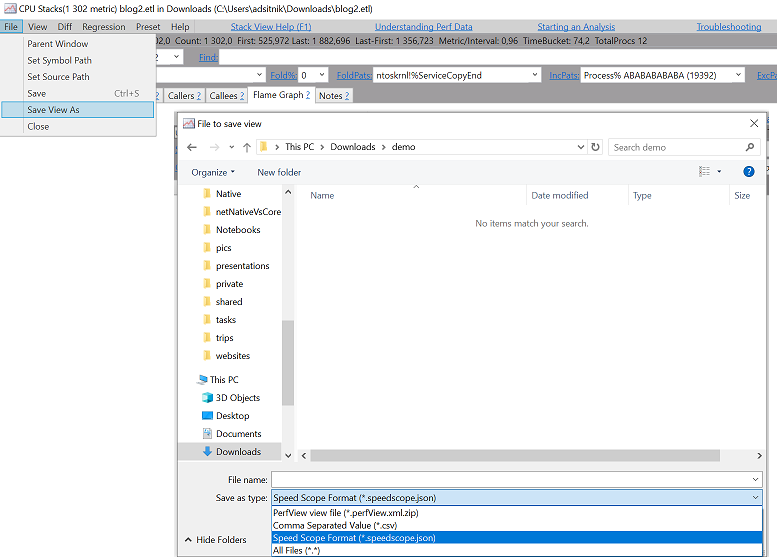
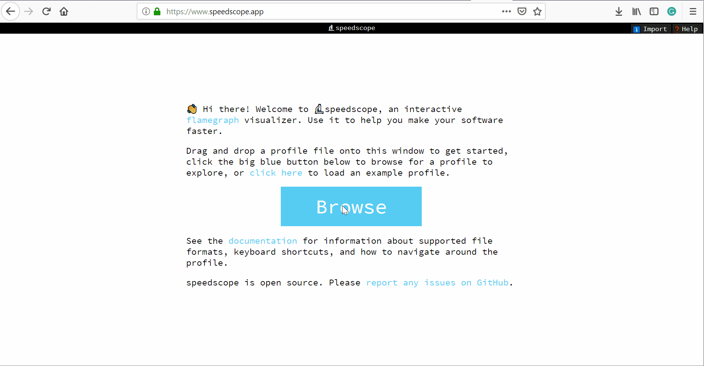
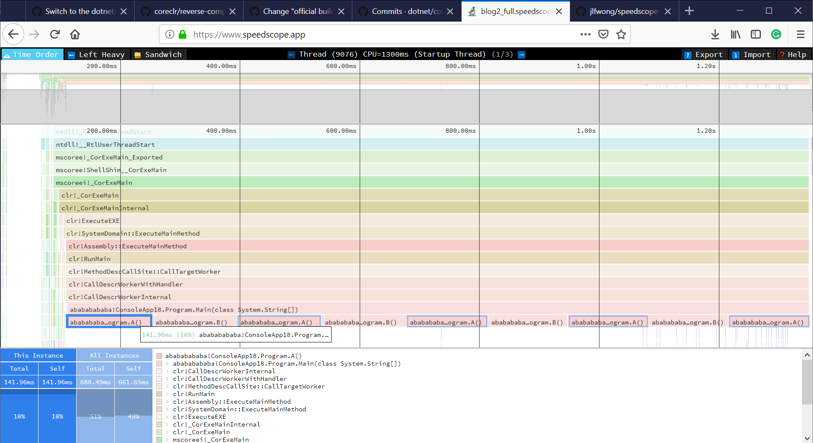
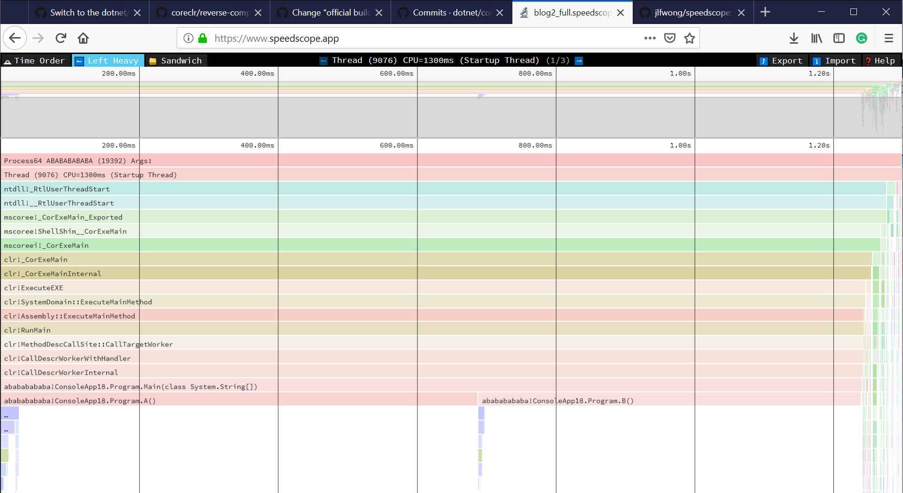
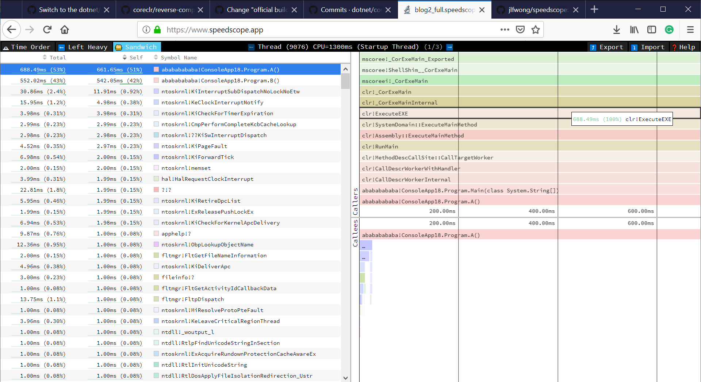
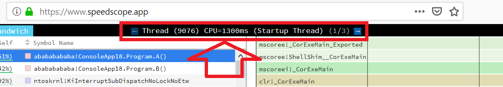
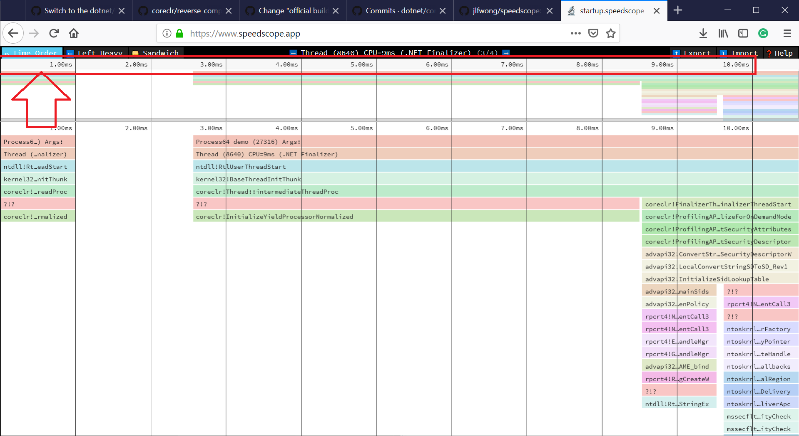
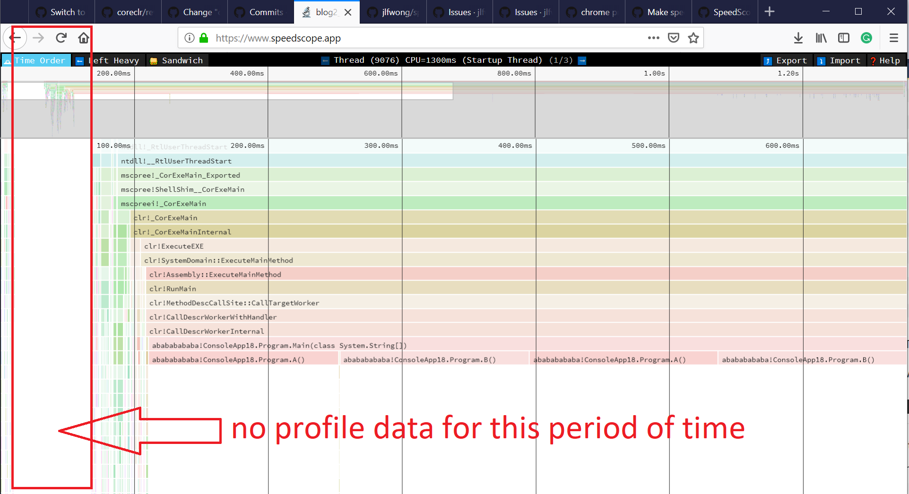
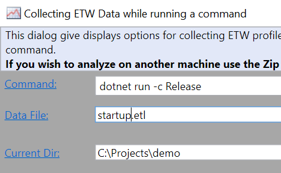
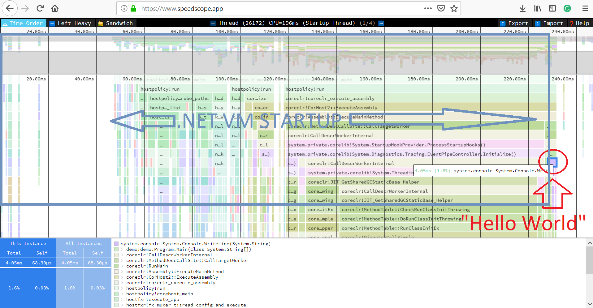

# speedscope.app

According to the [official web page](https://github.com/jlfwong/speedscope), [speedscope.app](https://www.speedscope.app/) is "a fast, interactive web-based viewer for performance profiles". But I believe it's more than that! In my opinion, it's one of the best visualization tools for performance profiles ever!

Some time ago I have implemented [SpeedScopeExporter](https://github.com/Microsoft/perfview/pull/842) which allows exporting any .NET Trace file to a speedscope json file format. It was released as part of `2.0.34` [TraceEvent](https://www.nuget.org/packages/Microsoft.Diagnostics.Tracing.TraceEvent/) library a few months ago, but so far it was not available for the end users from PerfView GUI/command line level.

Yesterday, a new version of PerfView got [released](https://github.com/Microsoft/perfview/releases/tag/P2.0.39) with the new possibility to export to speed scope file format. So now the PerfView users can use [speedscope.app](https://www.speedscope.app/) to view their performance profiles and take advantage of all the goodness it offers!

{: .center}


<!--more-->

## The Story

Vance Morrison, the .NET Performance Architect has emailed me and asked if I would like to implement web-based flame graphs for our non-Windows user story as I was the guy who [implemented](https://github.com/Microsoft/perfview/pull/502) it for PerfView a while back.

I knew that the app which does exactly what we needed have already existed. I did not remember the name but I remembered that I retweeted something about it, so I have opened the list of my retweeted posts and found it quickly.

I made sure that the app does not upload the data anywhere, has an MIT license, is actively maintained, has a self-contained version and can handle non-trivial files.

To my surprise, convincing Vance to use it was easy ;)

I did not want to introduce another file format so I decided to export the data to a very simple speedscope JSON-based file format ([spec](https://github.com/jlfwong/speedscope/blob/master/src/lib/file-format-spec.ts)).

I read the file format specification, wrote the tests first and made it work. Handling all edge cases was a lot of fun!

## How it works

[speedscope.app](https://www.speedscope.app/) is a single page application that works with any modern web browser. It supports plenty of file formats, including [perf](https://github.com/jlfwong/speedscope/wiki/Importing-from-perf-(linux)), [pprof](https://github.com/jlfwong/speedscope/wiki/Importing-from-pprof-(go)), [chrome](https://github.com/jlfwong/speedscope/wiki/Importing-from-Chrome) and [firefox](https://github.com/jlfwong/speedscope/wiki/Importing-from-Firefox). The profiles are not uploaded anywhere!

Every Trace File contains a huge amount of samples. A sample is more or less a call stack captured by the profiler. The job of [SpeedScopeExporter](https://github.com/Microsoft/perfview/blob/master/src/TraceEvent/Stacks/SpeedScopeStackSourceWriter.cs) is to group the samples by Threads, make sure they don't overlap in time, translate the frame ids to method names and save it in a format and order expected by the speedscope.

## How to use it?

If you want to export a trace file from PerfView, you need to open it, load the symbols, filter and from the "File" menu choose "Save View As" and then select "Speed Scope Format" from the combo box.

{: .center}


If you want to export a .NET Trace File to speedscope file format without using PerfView you either have to use TraceEven library yourself or wait until the dotnet collect diagnostic tool [merges](https://github.com/dotnet/diagnostics/pull/114) the support for it.

Once you have the `.speedscope.json` file you just need to open it with [speedscope.app](https://www.speedscope.app/). You can also download a self-contained version from [https://github.com/jlfwong/speedscope/releases](https://github.com/jlfwong/speedscope/releases).

{: .center}


## Demo

I have profiled the following C# app with PerfView and exported the trace file to `.speedscope.json` file. For brevity, I am going to skip the PerfView introduction here. You can find the JSON file [here](https://gist.github.com/adamsitnik/1b34626c20b86b48e0aca593567023f5).

```cs
class Program
{
    static void Main(string[] args)
    {
        A(); B(); A(); B(); A(); B(); A(); B(); A();
    }

    [MethodImpl(MethodImplOptions.NoInlining)]
    static void A()
    {
        for (int i = 0; i < 500_000_000; i++) { }
    }

    [MethodImpl(MethodImplOptions.NoInlining)]
    static void B()
    {
        for (int i = 0; i < 500_000_000; i++) { }
    }
}
```

### Time Order View

{: .center}


In the "Time Order" view, call stacks are ordered in chronological order. This is very unique compared to Flame Graphs because it allows us to understand the behavior of an application over time.

### Left Heavy

{: .center}


The "Left Heavy" is a reverse Flame Graph. The data is aggregated, not over time.

### Sandwitch

{: .center}


The Sandwich view is a table view with all methods from the profile and their associated times. You can sort by self time (exclusive time) or total time (inclusive time). 

When you click on one of the methods, you can see all the callers and callees of it. The app is so intuitive that it almost does not need any docs!

## Limitations

It's not possible to show data from multiple threads running at the same time on a single view, so every Thread has it's own "tab" and you can switch between the threads using the arrows:

{: .center}


Moreover, the app normalizes the relative time for every Thread. If we export a profile for Thread A that did some work between 0-200 ms and Thread B that did some work between 100-110ms the app will show the start time as 0ms for both of them and Thread B activity will be represented as between 0ms and 10ms (not 100-110ms). I was thinking about generating a 1e-10 ms long event at time 0ms for every Thread, but then the app would not scale the UI so nice.

{: .center}


If we don't have any profile information for a given period of time, we have nothing to show in the "Time Order View". It's important to remember that tracing in .NET captures only the call stacks of active Threads, so any blocking IO will be represented as a blank space. In the future, I might use the data from OS/.NET Runtime events to fill this space.

{: .center}


## Sample usage - .NET Core Process Startup Time

Using the new tool we can find out how long does it take to start a .NET Core process and see what exactly happens in what order during the startup.

To do that, we need to create a "Hello World" .NET Core app first.

```cmd
dotnet new console
```

Then tell the PerfView to Run following command:

```cmd
dotnet run -c Release
```

{: .center}


Disable grouping and folding, load all the symbols (see my [previous blog post](https://adamsitnik.com/Sample-Perf-Investigation/#analysing-the-trace-file) to learn how to do it) and export to speedscope format:

What is the cost of "Hello World" compared to the .NET VM Startup?

{: .center}


What took so long? Let's zoom it and find out!

{: .center}


### Kudos

[Jamie Wong](https://github.com/jlfwong) is the author of [speedscope.app](https://www.speedscope.app/) who deserves all the credit! I just wrote a simple exporter which allows us to use his awesome tool!
